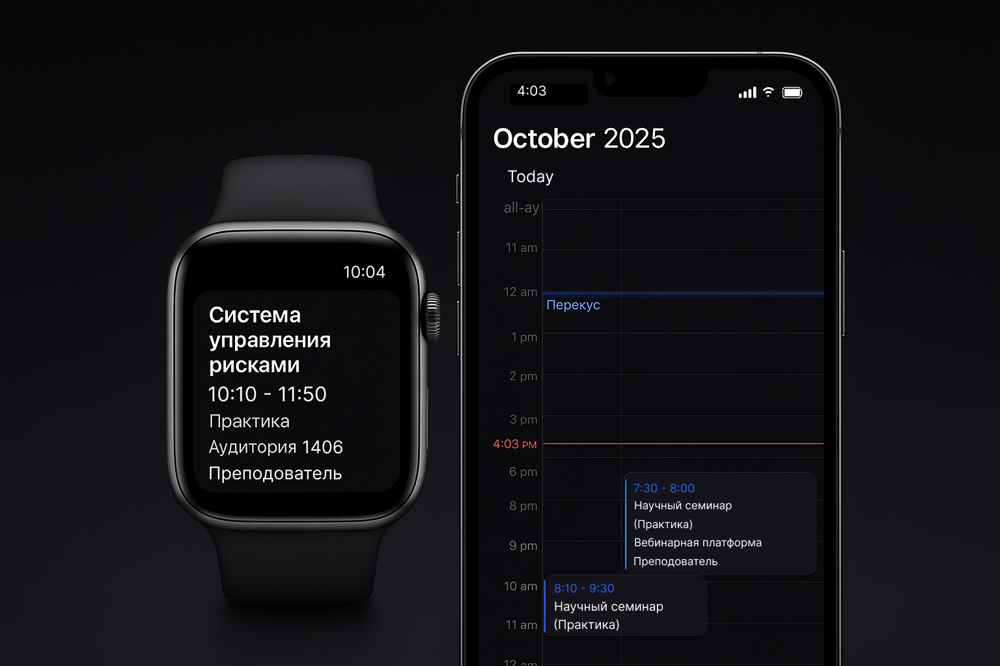
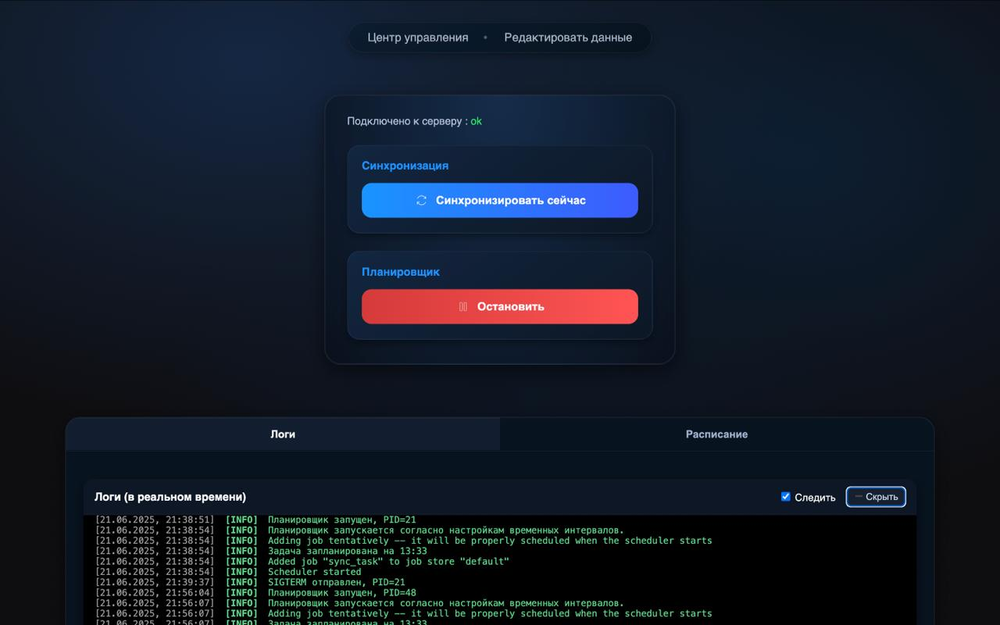
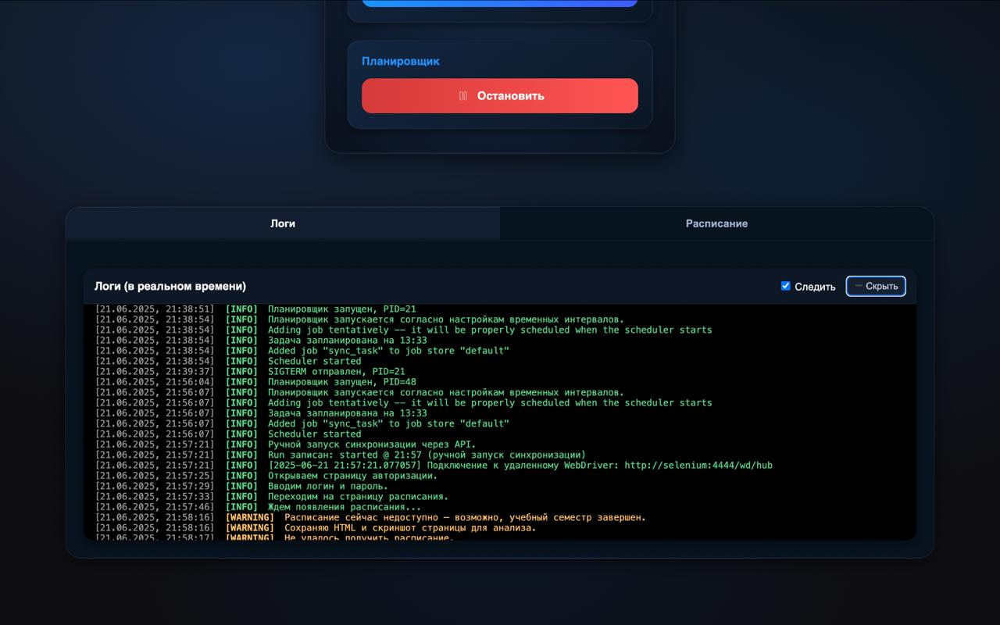
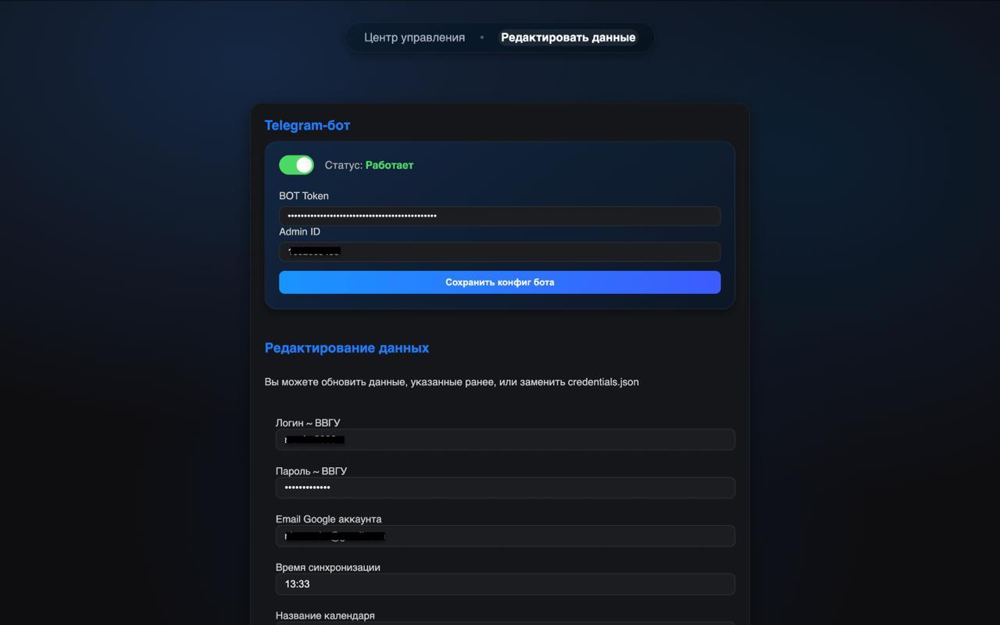

# Schedule-VVSU


[](https://github.com/NkvMax/vvsu-schedule/stargazers)
[](https://github.com/NkvMax/vvsu-schedule/network/members)
[](https://github.com/NkvMax/vvsu-schedule/blob/main/LICENSE)

<p align="center">
  <a href="https://github.com/NkvMax/vvsu-schedule">
    
  </a>
</p>

Проект для автоматической синхронизации расписания занятий из личного кабинета ВВГУ с Google Calendar. Позволяет извлекать расписание с сайта ВВГУ и автоматически создавать или обновлять события в календаре.

> [!TIP]  
> Доступна упрощенная **Lite-версия**, работающая только через GitHub Actions: [lite-version](https://github.com/NkvMax/vvsu-schedule/tree/lite-version)  
> Также доступна **Lite Self-Hosted** версия для запуска на своем сервере: [lite-selfhosted](https://github.com/NkvMax/vvsu-schedule/tree/lite-selfhosted)


## Screenshots

<details>
<summary>Open gallery</summary>

<p align="center">
  <a href="docs/assets/home.jpg">
    
  </a>
  <br/><sub>Control center</sub>
</p>

<table>
  <tr>
    <td align="center">
      <a href="docs/assets/logs.jpg">
        
      </a>
      <br/><sub>Live logs</sub>
    </td>
    <td align="center">
      <a href="docs/assets/settings.jpg">
        
      </a>
      <br/><sub>Settings</sub>
    </td>
  </tr>
</table>

</details>


## Что нового в v1.0.0

В этом релизе закрыт крупный этап развития проекта:

- **Web-UI**: регистрация/авторизация, интерактивное расписание, личный кабинет, мобильная адаптация  
- **Telegram-бот**: защищенные команды, кнопки «Синхронизировать» и «Статус», автоматические уведомления и логирование  
- **Calendar Sync**: надежный парсер через Selenium, синхронизация в Google Calendar, APScheduler с историей запусков  
- **HTTPS**: полное шифрование трафика через Caddy с internal CA и автоматическое обновление сертификатов  
- **Рефакторинг**: frontend на Vite + React + TypeScript, единая конфигурация и улучшенное логирование  

## Возможности

- **Web-интерфейс** для управления планировщиком и ботом.
    
- **Telegram-бот** для удаленной синхронизации расписания.
    
- Автоматический парсинг расписания с сайта ВВГУ.
    
- Создание и обновление событий в Google Calendar.
    

- CLI и Web-интерфейс для получения и синхронизации расписания напрямую с Google Calendar  
- Парсинг расписания через headless Chrome (Selenium-Firefox)  
- Автоматическое добавление, обновление и удаление событий в Google Calendar  
- Напоминания: за 1 час до первой пары и за 10 минут до остальных  
- Поддержка OAuth и Service Account аутентификации  
- Фоновые задачи (APScheduler) и мгновенный запуск синхронизации  
- Telegram-бот с кнопками «Синхронизировать» и «Статус», автоматические уведомления и автопересылка логов  
- Полноценный Web-UI: регистрация, авторизация, интерактивное расписание, просмотр логов и истории задач, мобильная адаптация  
- HTTPS с Caddy (internal CA) и автоматическим обновлением сертификатов  
- Docker-compose (prod/dev), multi-stage сборка, healthchecks для Postgres и Selenium  
- Единая конфигурация через `.env` и Pydantic Settings  


---

## Быстрый старт (Docker)

Склонируйте репозиторий и перейдите в каталог:

```bash
git clone https://github.com/NkvMax/vvsu-schedule.git
cd vvsu-schedule
```

Создайте `.env` из примера и заполните нужные поля:

```bash
cp .env.example .env
```

Запустите приложение:

```bash
make up
```

Для доступа к Web-интерфейсу через SSH-туннель:

```bash
ssh -L 8443:localhost:443 user@server_ip
```

Перейдите в браузере по адресу:

```
https://schedule.localhost:8443
```

---

<details>
<summary><b>Настройка Google Calendar (сервисный аккаунт)</b></summary>

<br>

1. Перейдите в [Google Cloud Console](https://console.cloud.google.com/).
    
2. Создайте или выберите существующий проект.
    
3. Перейдите в раздел **API и службы** → **Библиотека**, найдите и включите **Google Calendar API**.
    
4. Далее перейдите в **API и службы** → **Учетные данные**.
    
5. Нажмите **Создать учетные данные** → **Сервисный аккаунт**.
    
6. Заполните имя аккаунта и нажмите **Создать**.
    
7. Назначьте роль: **Проект → Редактор** и нажмите **Готово**.
    
8. В списке сервисных аккаунтов найдите созданный аккаунт, перейдите в него.
    
9. Перейдите во вкладку **Ключи** → **Добавить ключ** → **Создать новый ключ**.
    
10. Выберите тип ключа **JSON** и скачайте файл. Переименуйте его в `service_account.json`.
    
11. Загрузите полученный файл через Web-интерфейс приложения или поместите его по пути:
    

```
src/schedule_vvsu/json/credentials/service_account.json
```

Теперь приложение сможет автоматически взаимодействовать с вашим сервисным аккаунтом, который в свою очередь поделится календарем с вашим пользовательским аккаунтом. Далее вы сможете в обычном интерфейсе Google Calendar:

- Поделиться календарем с другими пользователями

- Настроить уровни доступа

- Изменить цвета и другие параметры отображения

</details>

---

⭐️ Поставьте **звездочку** на GitHub, если проект оказался полезен. 

Pull requests и предложения приветствуются!