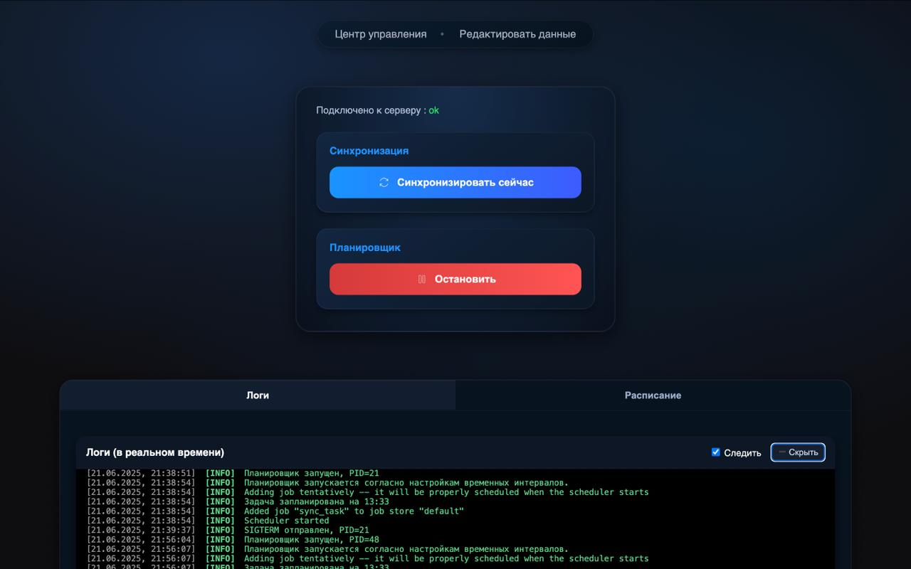
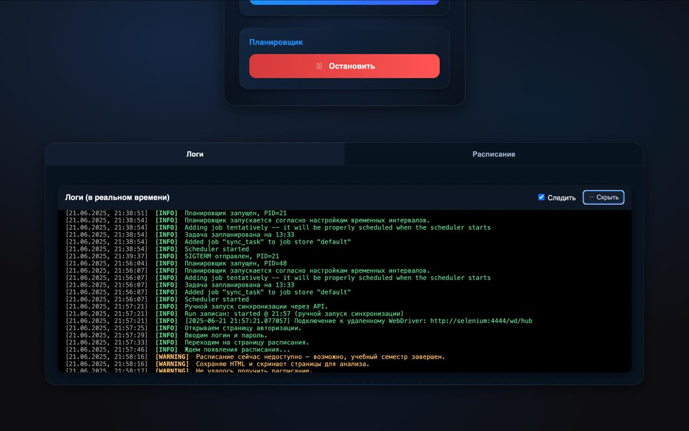

# Schedule‑VVSU — Web UI (React + TypeScript + Vite)

Панель управления для платформы:
  - запуск разовой синхронизации,
  -  старт/стоп планировщика,
  - просмотр живых логов,
  - управление токенами бота и настройками.

UI минималистичен, быстрый и сфокусирован на операционных задачах.

<p align="center">
  
  <br/><sub>Центр управления</sub>
</p>

<details>
<summary>Открыть галерею</summary>

<table>
  <tr>
    <td align="center">
      <a href="../../docs/assets/logs.jpg">
        
      </a>
      <br/><sub>Живые логи</sub>
    </td>
  </tr>
  <td align="center">
  <a href="../../docs/assets/settings.jpg">
    
  </a>
  <br/><sub>Настройки</sub>
</td>
</table>

</details>

---

## TL;DR

* **Стек**: React + TypeScript + Vite. Мгновенная разработка (HMR), строгая типизация.
* **Назначение**: операционная консоль для headless‑скрейпера/сервиса синхронизации и Telegram‑бота.
* **Интеграции**: REST для управляющих операций, **SSE/WS** для live‑логов.
* **Ops**: конфигурация через `.env`, статическая сборка, деплой на CDN/за прокси.
* **Качество**: type‑safe, lint/format, готовность к CI.

---

## Архитектура (вид со стороны фронтенда)

```
[UI] React SPA
   ├─ /api/status                ← состояние сервиса и планировщика (GET)
   ├─ /api/sync                  ← запуск разовой синхронизации (POST)
   ├─ /api/scheduler/start|stop  ← управление планировщиком (POST)
   ├─ /api/bot/config            ← чтение/обновление настроек бота (GET/PUT)
   └─ /api/logs/stream           ← поток логов (SSE или WebSocket)
```

* Управляющие действия идут через **REST**.


> Если бэкенд отдает другие пути — поправьте `VITE_API_BASE_URL` и endpoint клиента.

---

## Контракты API (DTO)

```ts
// GET /api/status
type Status = {
  ok: boolean;
  version: string;
  scheduler: { running: boolean; pid?: number; nextRun?: string };
};

// POST /api/sync -> 202 Accepted
type SyncResponse = { accepted: boolean; runId: string };

// POST /api/scheduler/start|stop -> 200 OK
type SchedulerResponse = { running: boolean };

// GET/PUT /api/bot/config
type BotConfig = {
  enabled: boolean;
  tokenMasked: string;  // в GET возвращается маска
  adminId: string;      // в PUT может указываться сырой token для записи
};
```

> Держим полезные нагрузки простыми и стабильными. UI должен деградировать мягко при появлении новых полей.

---

## Лицензия

- MIT

---

## Changelog (UI)

* `v1.0.0`: операционная консоль, живые логи, экран настроек бота.

